> Mentor: [Mr. Suraj Kumar](https://sites.google.com/view/kumarsuraj/bio), Research Scientist, Satellite Centre, Indian Space Research Organisation (ISRO).

::: {#fig-fp_video}

<video src="videos/Go2_FootPlacement_Disturbance.mp4" width="600" autoplay loop muted playsinline></video>

Go2 quadruped with RL foot placement policy and joint-level whole body controller.
:::

## Introduction

This **summer internship report** outlines the project and contributions of my internship at UR Rao Satellite Center (URSC), Indian Space Research Organisation (ISRO) under the mentorship of Mr. Suraj Kumar, Scientist at URSC. My presentation video can be seen [here](https://plakshauniversity1-my.sharepoint.com/:v:/g/personal/suraj_dayma_ug23_plaksha_edu_in/IQDk0ovFDTW-T6eSfeXCVRljAd1e71Doe2rtZPFwQLa4l34?e=1bfgg1). This project is part of the Chandrayaan-5 mission (lunar southern pole exploration), and the work is intended to be used for lunar exploration using legged robots.

The goal of this project titled _'Learning & Control for Legged Locomotion'_ involves designing proprioceptive controllers for quadruped and bipedal locomotion using optimisation and learning based methods. Proprioception here means that no perception system such as cameras, LiDARs, etc. are used for environment sensing. The only sensory information about the environment and terrain is received from foot contact and interaction alone. This is also referred to as blind locomotion. The command fed into all control pipelines mentioned in this document includes the forward and lateral velocities and the robot's yaw rate. No navigation or path planning is being considered here, we are concerned with joint level control of legged robots to achieve a desired velocity.

[@sec-learning-control] outlines the end-to-end reinforcement learning (RL) based methodology while [@sec-optimisation-control] outlines the traditional optimisation based methods. This project aims to combine the two approaches in a strategy called hierarchal reinforcement learning. It is recommended that [@sec-background] be read first to understand the problem statement.

## Problem Statement {#sec-problem-statement}

For quadrupeds, and bipeds, we are interested in designing proprioceptive hierarchal reinforcement learning controllers to track some desired velocity vector. These controllers use an RL policy as a high-level (HL) planner and a low-level (LL) optimisation based controller to track the high-level trajectories.

We would like to develop the experimental simulation and training suite to benchmark such a control framework with different HL and LL controllers against existing optimisation and learning based methods.

My primary task during this internship was to design this software suite.

## Background Research {#sec-background}

The two control methods discussed in this document are the optimal control, or optimisation based control, and the learning based control. When designing controllers for such a high degree of freedom (DoF), we can constrain the higher order system to a simpler model of the system, called template or reduced-order, or simple model. This approach is called the prescriptive approach and limits the dynamics of the full system as it is being constrained to a simple model. If the higher order system really behaves like a simpler system, then we lose no dynamic ability and can more accurately and fully control the system. Our goal should usually be to try to control a system in the descriptive manner, but the prescriptive approach is usually seen being used due to its ease of design and safety constraints [@kumarDescriptiveModelbasedLearning2025].

### Optimisation Based Control {#sec-optimisation-control}

Legged walking and balance is a challenging task due to its multiphase, hybrid nature and high-dimensional state space. However, we observe that bipedal and quadruped balance is inherently low dimensional and can be effectively described with simple state and action descriptors in a low-dimensional state space [@joshiDiscreteTimeModel2024]. Traditional real time control techniques exploit this fact and utilise a hierarchical or cascaded control system. With the command being some desired velocity vector, these hierarchical controllers split the balance across a high-level (HL) and low-level (LL) controller split. The high-level controller in charge of calculating desired foot placement and the low-level controller tracks intermediate trajectories and ensures the higher level command are achieved in some feasible time.

This high-level controller is usually based on some simple / template / reduced-order model of the robot so it can be run in real time. This controller is typically some variant of **_model predictive control (MPC)_**. The robot kinematics are used to generate trajectories which realise these high level outputs and are then tracked by a low-level controller which outputs the joint torques. This low-level controller is typically an inverse kinematics or quadratic programming based controller.

An optimisation based control strategy like the HL MPC suffers from numerical shortcomings such as short planning horizon, convergence to local optima and deviations between the template model and actual dynamics [@kovalevCombiningModelpredictiveControl2023]. Moreover, predefined gait and trajectory generators are used to generate reference trajectories for the LL controller to track, which bottlenecks the robustness and generality of locomotion.

### Learning Based Control {#sec-learning-control}

Such optimisation based control methods arise from deeply understanding the mechanics of these robots and are limited by one's ability to formulate these problems. On the other hand, learning methods such as end-to-end reinforcement learning rely only on learning the controller (also called policy) from data of the robots motion under different actions. Improvements in hardware accelerators, simulators, and deep learning frameworks have increased our ability to train these policies and create very robust controllers such as [@haLearningbasedLeggedLocomotion2024a] and [@liRobustVersatileBipedal2023].

### Tradeoffs

Learning based methods are often easier to design, and yield more robust controllers. Tough training these policies is computationally expensive, the inference time computation is a cheap forward pass of the policy, compared to an online optimisation in the former case. Deep RL policies also struggle in safety-critical situations such as stepping stones and confined environments. This requires handling safety constraints which is much easier to enforce in an optimisation based controller [@haLearningbasedLeggedLocomotion2024a]. It is also not an approach where skills like traversing stairs, handling varying friction, etc. is discovered on its own. Usually careful reward tuning is required to achieve a skill and regulate the policy.

### Hierarchal Reinforcement Learning

While both RL and optimal control aim at finding the optimal policy for a desired task, they have complementary features that attract researchers to devise frameworks that benefit from the best of both worlds. In this report, we are interested in learning high-level RL policies to set commands for a model based low-level optimisation controller. Such a framework has shown promising results for quadrupeds in simulation and on hardware [@leeLearningQuadrupedalLocomotion2020], and for bipeds in simulation [@castilloTemplateModelInspired2023; @soniMELPModelEmbedded2023].

## Methodology {#sec-methodology}

### Optimisation Based Control

::: {.column-page layout="[45,55]"}
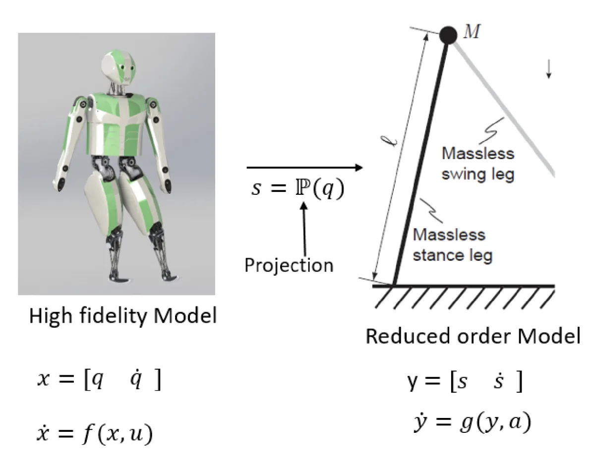{#fig-order-models}

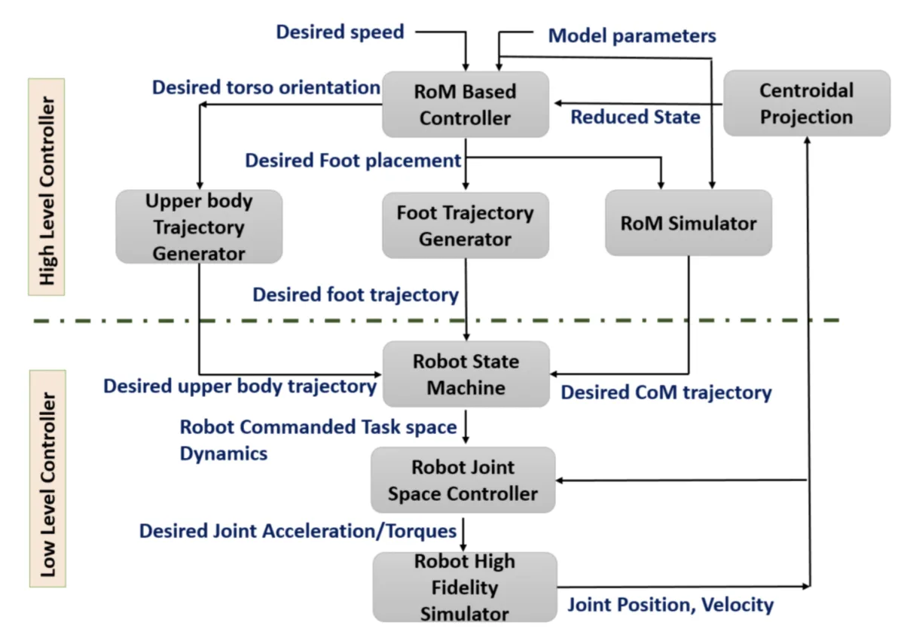{#fig-prescriptive}
:::

A prescriptive control block diagram from [@kumarDescriptiveModelbasedLearning2025] is shown in [@fig-prescriptive]. Its constituent components are described below.

- **Robot State Machine**: A legged robot can be modelled as a state machine with respect to its feet states — swing and stance. In swing state, the feet track a desired gait, and in stance state, they exert some force on the ground to keep the robot balanced and achieve some target height command.

- **RoM Simulator**: The reduced order model (RoM) simulator simply takes in RoM parameters and desired command and outputs the centre of mass (CoM) by integrating the simple dynamics equations of the RoM.

- **RoM Based Controller**: The reduced order model (RoM) operates with the simple model dynamics and states. It computes the desired foot placement for a foot in swing (see [@raibertDynamicallyStableLegged]) or ground reaction forces for a foot in stance (see [@dicarloDynamicLocomotionMIT2018]).

- **Foot Trajectory Generator**: The gait of the robot (parameterised by how long a step is, how much of that step is spent in stance vs swing, and the relative phases between all legs) is fixed. This block interpolates the current foot position and target foot placement to generate a smooth trajectory for the LL controller to track.
  - **Upper Body Generator** does the same thing for upper body tasks such as upper body orientation and robot specific tasks (e.g. trajectory for the arms of a humanoid).

- **Robot Joint Space Controller**: The LL controller. Different variations exist and can be swapped independent of the HL controller granted the inputs and outputs are the same, see [@castilloTemplateModelInspired2023] for a HL policy with different LL controllers. [@dicarloDynamicLocomotionMIT2018] uses a virtual force controller, [@leeLearningQuadrupedalLocomotion2020] uses a PD controller on joint position outputs from the HL policy, [@kimHighlyDynamicQuadruped2019] uses a whole body controller.

For the policies trained and experiments ran, we used a variant of the whole body controller, termed as the **task space controller**.

### Hierarchical RL

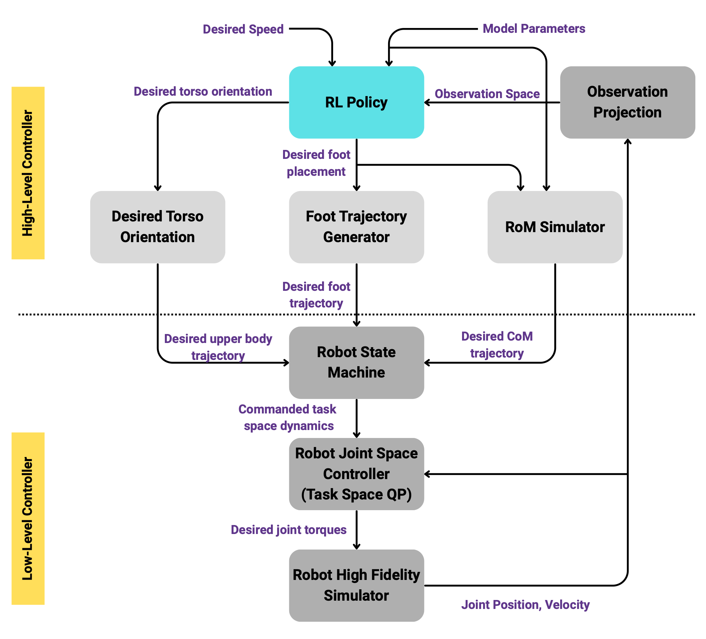{#fig-hrl width=70%}

An overview of the hierarchical RL control pipeline can be seen in [@fig-hrl]. Much of the components and analogous to those in [@fig-prescriptive].

### Software Pipeline

I was provided internal repositories with implementations of [@dicarloDynamicLocomotionMIT2018; @kumarDescriptiveModelbasedLearning2025; @joshiDiscreteTimeModel2024] in the [MuJoCo](https://mujoco.readthedocs.io/en/stable/overview.html) simulator.

My primary contribution was building a **modular simulation and training environment** which would allow us to run tests on different robots, and to swap in the aforementioned template models, low-level controllers, physics simulators (MuJoCo, Isaac Lab, Pinocchio), navigation stacks, and RL policies. This makes the components of [@fig-prescriptive] become interchangeable parts.

#### Architecture {#sec-architecture}

| Layer | Responsibility | Swap unit |
|---|---|---|
| Simulation adapter | The only code that speaks to a specific physics engine; exposes `reset`, `step`, `dt` and external-force hooks | MuJoCo / Isaac Lab / Pinocchio |
| Robot abstraction | Kinematics, dynamics quantities, joint and leg naming, torque limits | Robots Tested: Go2 (Quadruped) / Tron1 (Biped) / Tron1-SF |
| Action interface | Maps the policy output vector to the reference dictionary the low-level controller consumes | ALIP, foot-placement + GRF, foot-placement only, SRB variants |
| Low-level controller | Solves for joint torques that realise the references | Task-space inverse dynamics, WBC, PD |
| Term layer | Observation and reward terms, each a small named object with a declared dimension | Any subset, per task |
| Training layer | Vectorised environments, PPO, callbacks, run directories | Any RL library behind a runner wrapper |

### Experiments {#sec-other-experiments}

Alongside the suite itself, several methods from the literature were reimplemented inside it.

**ALIP template-model policies.** The angular-momentum linear inverted pendulum formulation of [@castilloTemplateModelInspired2023] was replicated, with the policy setting foot placement targets and the task-space controller tracking them.

**Latent-space observations.** Following [@castilloDataDrivenLatentSpace2024], an autoencoder was trained offline over full robot states (37 dimensions: generalised positions and velocities) and its encoder used, at inference only, as an observation term producing a compact learned state descriptor.

**Proprioceptive-only terrain traversal.** The approach of [@yuVisualLocomotionLearningWalk] was replicated with the perceptual component removed, keeping only proprioceptive observations.

**Disturbance curriculum.** Policies were tested with and without applied disturbance during training and were benchmarked against each other.

### Measured Metrics {#sec-metrics}

Every policy and controller is reduced to the same small set of quantities, computed identically and under identical initial conditions. The following quantities are tested at different commands velocities in both lateral and forward direction.

| Quantity | Definition | Inferred Quantity |
|---|---|---|
| Mean velocity error | $\lvert v - v_{\text{cmd}} \rvert$ averaged over the post-settling window | Steady-state command tracking |
| Std. velocity error | Standard deviation of the error within an episode | Gait-induced jitter and limit-cycle quality |
| Failed grid points | Count of commands that terminated the episode | Effective command envelope |
| Maximum survivable push | Max survived push disturbance applied at different directions and velocities | Disturbance rejection |
| Push anisotropy | Per-heading breakdown of the above | Direction in which controller is weakest in. |

## Results {#sec-results}

### Robot Agnostic Controllers

The ported whole body controller and MPC stack can be seen working for a quadruped as well as a biped here.

::: {#fig-tron1-strip layout-ncol=5}
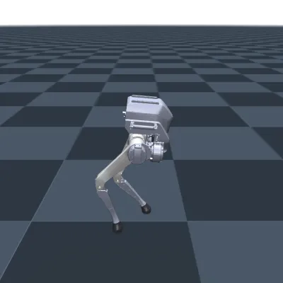

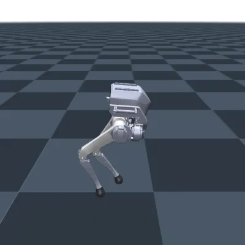

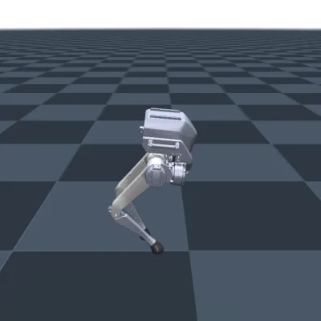

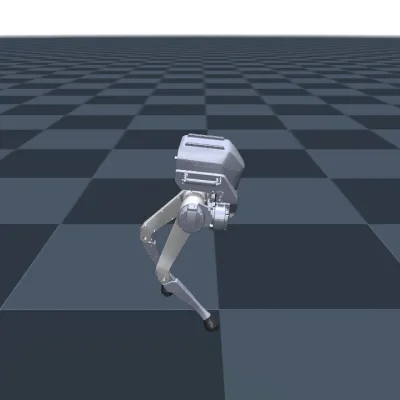

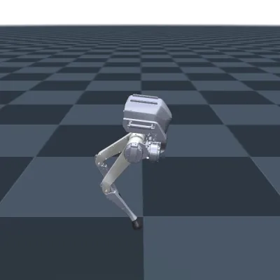

Tron1 biped. Frames sampled from an MPC+WBC rollout, time running left to right.
:::

::: {#fig-go2-strip layout-ncol=5}
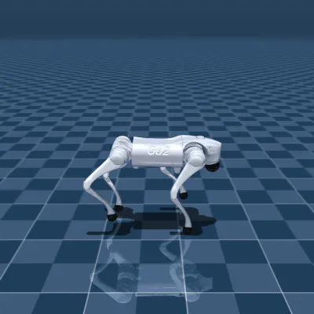

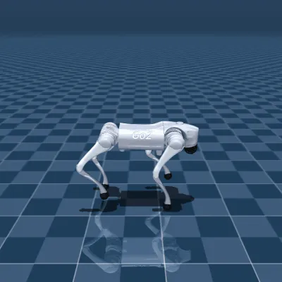

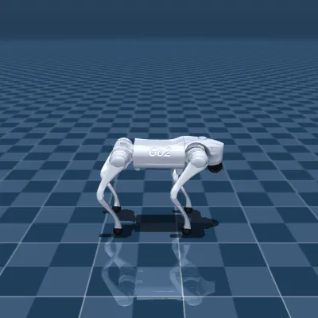

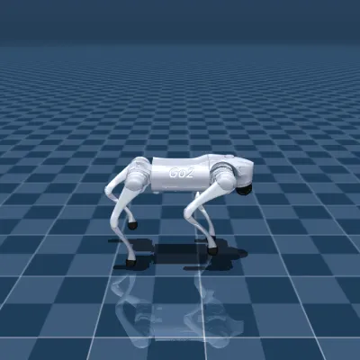

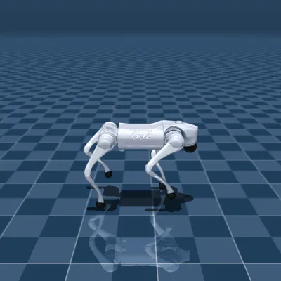

Unitree Go2 quadruped. Frames sampled from an MPC+WBC rollout, time running left to right.
:::

### Hierarchical RL Policies

[@fig-fp_video] shows a video of the RL foot placement policy in conjunction with the LL controller surviving a push.

## References {.unnumbered}

::: {#refs}
:::
