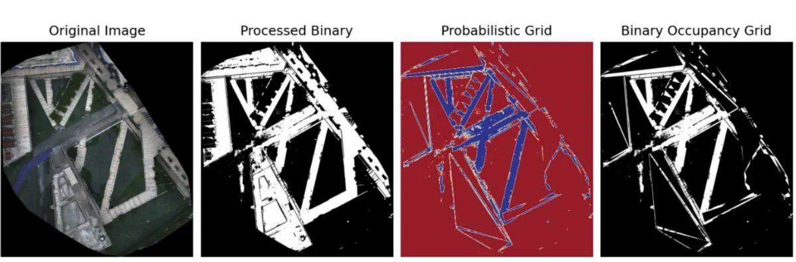
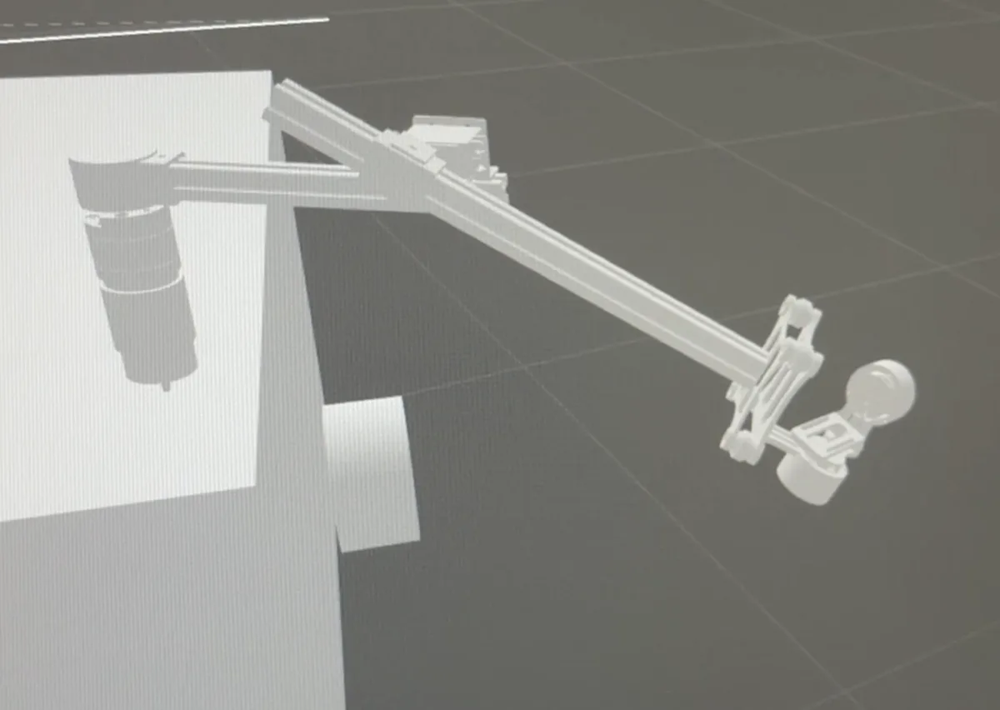

> Supervisor: [Prof. Sunita Chauhan](https://au.linkedin.com/in/sunita-chauhan-b040a48b)

### Project Description

I worked under Prof. Chauhan on a multi-agent precision agriculture project aimed at early distress detection in plants. Our ecosystem included UAVs which would map large areas quickly and using multispectral imagery, detect stress zones in a large agriculture field. These locations would be inspected at a lower altitute by the UAVs to detect diseases, or identify the cause of stress. In such cases, an autonomous ground vehicle (UGV) would be deployed for closer inspection, and intervention. This UGV would be an ATV or similar farm vehicle which can navigate most terrains.

### Contributions

I worked entirely on the UGV subsystem of this project. I created a testbed robot equipped with LiDAR, IMU, GPS, ultrasonic sensors, and a camera, and integrated the hardware and software using a ROS2 pipeline.

I implement SLAM and mission planning on the test robot, as well as tuning the ROS2 controllers for these tasks. I also generated static maps from both LiDAR data and drone imagery and ran localization algorithms on the robot.

{width=600}

{width=600}

{width=600}

A 4 DoF manipulator was also design and simulated in Gazebo. As of now, 3 links have been fabricated and controlled using simple PID controllers with encoders and IMU for feedback.

{width=600}

### Future Work

An ATV has been procured and a team will be working on automating the machine, and I will be assisting which integrating my software for control and mission planning for field trials.
