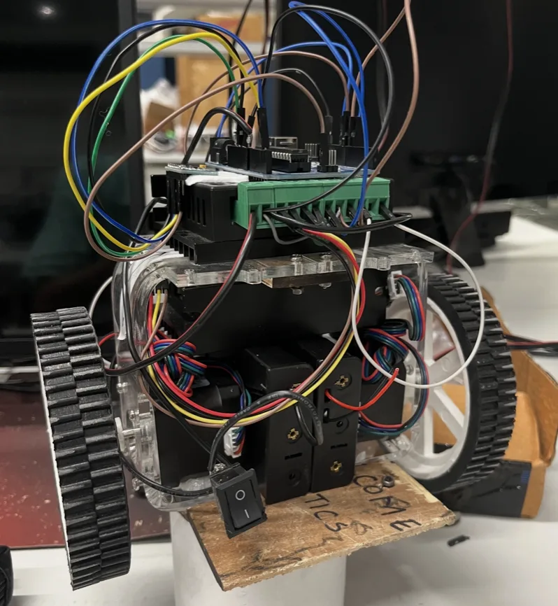

::: {.link-row}
[<i class="bi bi-file-earmark-text"></i> Presentation](/assets/files/BalancingBotPresentation.pdf)
[<i class="bi bi-play-fill"></i> Video](https://plakshauniversity1-my.sharepoint.com/:v:/g/personal/suraj_dayma_ug23_plaksha_edu_in/IQDtH-bvJljBT5serVaLuYi7AWsb5gbIjDkmA-NjLdE0UoU?e=J0hydy)
:::

The goal of this project was to build a simple balancing bot inspired by the cart-pole system. And implement PID control to keep the bot upright.

An IMU was used along with stepper motors as the sensors and actuators. I used the complimentary and kalman filters to process the accelerometer and gyroscope data for tilt estimation.

I also used the Ziegler–Nichols method for PID tuning and performed sensor and motor characterization as well to find response time and create a simple model of the system.

