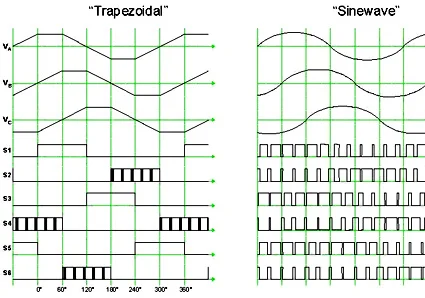
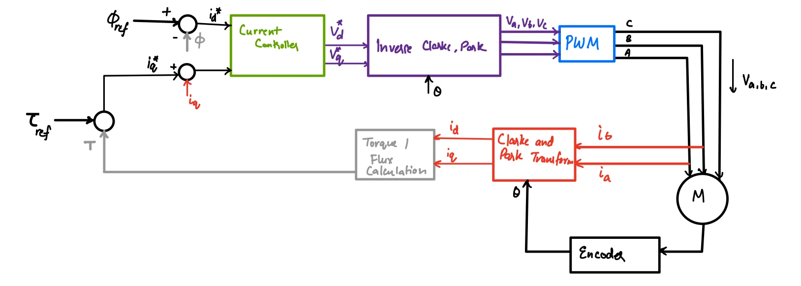

*Mentor: [Prof. Srikant Srinivasan](https://plaksha.edu.in/faculty-details/dr-srikant-srinivasan), Plaksha University.*

The *FOC Motor Control* part aims to implement field oriented control (FOC) for brushless DC (BLDC) motors which is a motor control techn$I_q$ue that allows for precise torque control of motors. This is useful as all control theory and physics deals with torques when we want to accurately actuate a system. However, we can only modulate the voltage going into a motor and thus accurate current / torque control is a difficult problem which would allow for easier control over dynamic systems.

## BLDC Motor Control

The main components of BLDC motor control include:

1. Commutation: which of the 6 MOSFETs in the 3 half bridges are on and off. This dictates how to send current into the three phases of the motor.
2. Modulation: dictates how much current to pass into the motor phases.
3. Control: how we decide to commutate and modulate the motor with feedback from hall effect sensors or rotary encoders.

### Control

There are two control ideologies that exist:

1. **Scalar Control:** Only dictates the magnitude of voltage and frequency.
2. **Vector Control:** Dictates both the magnitude and direction of currents.

### Trapezoidal Commutation

Trapezoidal commutation is commonly implemented using three Hall effect sensors to determine the rotor position. The combination of the three sensor outputs divides one electrical revolution into six distinct sectors, each spanning 60 electrical degrees. Within each sector, a fixed pair of MOSFETs is energized to drive current through two of the motor phases while the third phase remains unpowered. As the rotor moves from one sector to the next, the Hall sensor state changes, triggering a commutation event in which the controller switches to a new MOSFET pair. This six-step switching sequence provides a simple and robust method of controlling BLDC motors, at the expense of torque ripple and inaccurate positioning.

### Sinusoidal Commutation

Sinusoidal commutation uses continuous rotor position information to generate sinusoidal phase voltages or currents. Instead of applying fixed switching states over discrete sectors, the controller continuously varies the duty cycle of each phase according to the rotor's angular position. This creates a rotating magnetic field that changes smoothly throughout the electrical cycle, resulting in more uniform torque production. The primary motivation for sinusoidal commutation is to reduce torque ripple, vibration, and acoustic noise while improving efficiency and smoothness, particularly at low speeds.

In trapezoidal commutation, the speed of the motor is directly controlled by varying the PWM duty cycle (thus varying the voltage passing into the motor). Thus the PWM duty cycle is what controls the modulation in trapezoidal commutation.

In sinusoidal commutation, each phase is operated at a different and varying duty cycle and the speed is maintained by varying a modulation parameter, $m$. The relation between $m$ and the three duty cycles is given below and is how we modulate voltages / currents in sinusoidal commutation.

- Encoder to get mechanical angle $\theta_m$
- Electrical angle $\theta_e = \theta_m \times \text{no. of poles}$

$$
\begin{aligned}
d_a &= 0.5 + 0.5 \times m \sin(\theta_e) \\
d_b &= 0.5 + 0.5 \times m \sin(\theta_e + \tfrac{2}{3}\pi) \\
d_c &= 0.5 + 0.5 \times m \sin(\theta_e + \tfrac{4}{3}\pi)
\end{aligned}
$$

## FOC Control

FOC motor control relies on some transformations for directing the currents. Clarke and Park transforms are used for converting the current in each phase to $I_q$ and $I_d$. We want to maximise $I_q$ and minimise $I_d$ because one produces torque and the other minimises the flux produced by the rotor.

### Current Sensing

For true FOC motor control, we would require reliable current sensors which can be attached in our circuits in three configurations:

1. **High Side:** current sensor placed in series between the power supply positive and MOSFETs source.
2. **Low Side:** current sensor placed in series between the power supply negative (or ground) and MOSFETs drain.
3. **Inline:** current sensor places in series between the half bridge output and motor phases.

High and low side current sensing can be achieved using current amplifiers connected to the micro-controller's ADC. However all of these paths will have high frequency PWM signals (typically 10-20 kHz), the ADC needs to be sampled very accurately within a single time period of the PWM signal. These configurations also need access to the half-bridge circuitry of the motor driver, which in our case was enclosed in one IC and could not be accessed.

Therefore, our only option for current sensing was inline sensing. ADC sampling in inline sensing is not time dependent, however you must make sure the current amplifier or current sensor has good PWM rejection.

The only current sensor we were able to obtain was the ACS712. Which is a hall effect based current sensor with a range of 10A (-5A to 5A) with a sensitivity of 185 mV/A.

The max current range of our motor is only 2A (-1A to 1A) and with the relatively poor sensitivity of the ACS712, we would not be able to accurately capture the transient currents of our motor.

## STM Motor Control Implementation

Everything expect the current feedback path from the block diagram above was implemented on hardware, thus implementing open loop FOC control.

### Components

1. 2805 140KV Gimbal **BLDC Motor**
2. DRV8313 **Three Phase Half-Bridge Gate Driver**
3. ASC712 **Current Sensor** x 2
4. 600 PPR **Optical Encoder**
5. Nucleo H7A3ZI-Q **Dev Board**

4 voltages dividers were also used for the 2 encoder signals, and 2 current sensor signals. External pullups were used on the encoder signals which was much more reliable than the internal pullups on the STM.

### IO

#### PWM Signals

Three channels of TIM1 of the STM32 were used to generate the three PWM signals to the gate driver. These PWM signals were center aligned, and controlled at a frequency of $\sim$1 kHz.

Capture Compare Register (CCR) used to control this frequency in this manner:

$$
\begin{aligned}
\text{PWM}_{freq} &= \frac{\text{Timer\_clock}}{2\,(\text{PSC} + 1) \times \text{ARR}} \\[8pt]
\text{Timer\_clock} &= 64\ \text{MHz} \\
\text{PSC} &= 0 \\
\text{ARR} &= 2^{16}\ \text{max}
\end{aligned}
$$

TIM1 interrupts were used to run the control logic and sample ADC.

#### ADC

The ADC was used for the two current sensors. The ADC was trigged every-time the TIM1 interrupt was ran.

For calibrating the zero offset current of the sensors, the sensor was polled 1000 times and the readings were averages. This was done before enabling the timer interrupt but the ADC polling timed out every time. We were not able to debug this issue and given the poor resolution of the current sensors, we implemented open loop FOC in our final demo.

#### Optical Encoder

The STM has built in timers specifically for reading and decoding quadrature encoders. One of these timers was used with the 2 signals of the encoder and interrupts were enabled on transitions of these two digital input pins. On each transition, this interrupt updated the encoder count as well as the mechanical and electrical angle variables.

### Startup Alignment

At all times, the motor's rotor and stator positions need to be aligned (or calibrated or zero offset-ed from each other) so that the electrical angle and further modulation calculations can be performed correctly. This is done by simply exciting one of the phases at startup so that the rotor aligns itself with the stator's field. This angle measurement is the zero offset measurement. All the interrupts are enabled only after this startup is complete.
